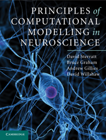

{: style="float: right"}

I am a researcher in
[Douglas Armstrong's](http://www.inf.ed.ac.uk/~jda) group at the
[Institute for Adaptive and Neural Computation](http://www.anc.ed.ac.uk/)
in the [School of Informatics](http://www.inf.ed.ac.uk/) at the
[University of Edinburgh](http://www.ed.ac.uk/).

## Research

My research interests are in the area of computational neuroscience and
include:

* [Multiscale modelling of biochemical networks within compartmental
  models of neurons](/projects#multiscale-modelling-of-biochemical-networks-within-compartmental-models)
* [Measuring and modelling the development of topography in the nervous system](/projects#development-of-the-nervous-system),
  including the [Retistruct software package](/projects#retistruct)
* [Learning and memory](/projects#learning-and-memory)

{: style="float: right"}

## Book

David Sterratt, Bruce Graham, Andrew Gillies and David Willshaw.  
[Principles of Computational Modelling in Neuroscience.](http://www.cambridge.org/gb/knowledge/isbn/item6025106/?site_locale=en_GB)  
CUP. July 2011.  
ISBN: 9780521877954.

Look inside at
[CUP](http://www.cambridge.org/gb/knowledge/isbn/item6025106/?site_locale=en_GB).

See the [book website](http://www.compneuroprinciples.org/), complete with code for many of the figures.

## Other work

I am energy coordinator for the Informatics forum -- see the
[Informatics Energy Blog](http://blog.inf.ed.ac.uk/energy/).

## Latest blog posts

  <ul class="post-list">
    
      <li>
        {{ post.date | date: "%b %-d, %Y" }}

        <h2>
          <a class="post-link" href="{{ post.url | prepend: site.baseurl }}">{{ post.title }}</a>
        </h2>
      </li>
    
  </ul>

  
subscribe <a href="{{ "/feed.xml" | prepend: site.baseurl }}">via RSS</a>

<!--  LocalWords:  Retistruct retistruct Sterratt Willshaw Blog blog
 -->
<!--  LocalWords:  ul li href prepend baseurl endfor rss
 -->
